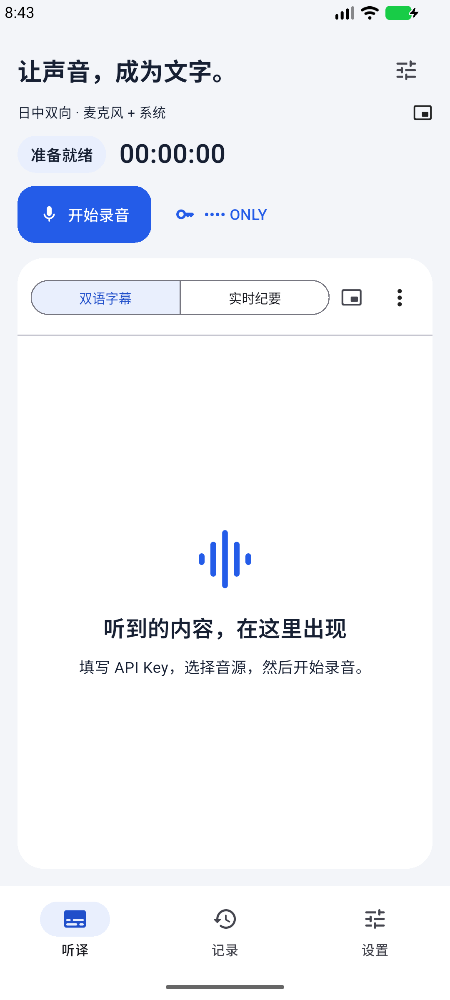
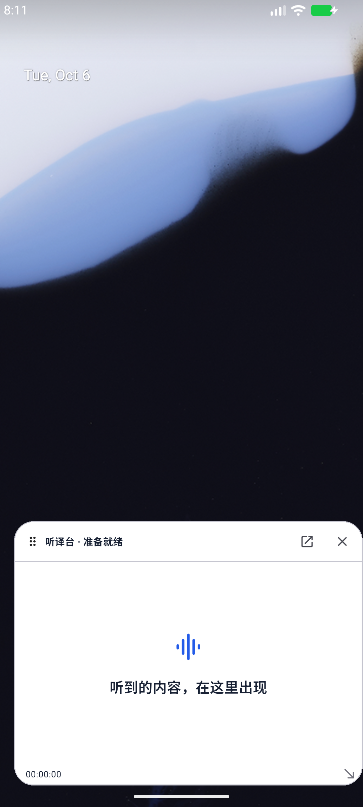

# 听译台

[English](README.md) · [简体中文](README.zh-CN.md) · **日本語**

LingoDesk は、会話や Android 端末で再生する音声をリアルタイムで二言語字幕にし、議事メモにまとめるアプリです。授業、オンライン講座、会議、日常会話に使えます。ほかのアプリを使いながら、フローティング字幕で訳文を読むこともできます。

## スクリーンショット

 

[APK をダウンロード](https://github.com/Stickmin522/LingoDesk/releases/latest)

## 主な機能

- マイク音声、システム音声、または両方を録音。
- 日中・英中の双方向翻訳。原文と訳文を並べて表示。
- ボタンで二言語字幕と議事メモを切り替え。
- 履歴の閲覧やほかのアプリの使用中も、録音と翻訳をバックグラウンドで継続。録音の終了はアプリ内で操作。
- フローティング字幕の移動とサイズ変更。ツールバーは自動で隠れ、ウィンドウを閉じても録音は継続。
- フローティング表示の有効状態、位置、サイズを記憶。
- 保存した録音の再生と、WAV・TXT・SRT・JSON 形式での出力。
- スマートフォン、タブレット、横画面、分割画面、折りたたみ端末に対応。ライト・ダークテーマを選択可能。

## 使い方

Android 10 以降の ARM64 端末に対応しています。アプリの表示言語は簡体字中国語です。

1. APK をインストールし、下の説明に従ってサービスを設定します。
2. 翻訳言語と音源を選び、必要な権限を許可して録音を開始します。
3. フローティング字幕と「ほかのアプリの上に表示する」権限を有効にすると、ホームに戻ったあとも字幕を読めます。
4. アプリに戻って録音を停止・保存します。履歴から再生や出力ができます。

## LecSync

音声認識、リアルタイム翻訳、議事メモには LecSync API を使用し、インターネット接続が必要です。[LecSync コンソール](https://www.lecsync.com/dashboard/api)で自分の API キーを作成し、アプリの設定に入力してください。使用量と料金は、そのキーのアカウントに計上されます。アプリは API に直接接続するため、別途構築した翻訳サイトには依存しません。録音と履歴は端末内に保存され、ウェブサイトのアカウントとは同期されません。サービスの詳細は [API の説明](https://www.lecsync.com/developers)を参照してください。

## ソースからビルド

[ビルド手順](docs/BUILD.md)を参照してください。

## 関連キーワード

Android、Flutter、Rust、Kotlin、リアルタイム翻訳、音声認識、二言語字幕、フローティング字幕、バックグラウンド録音、音声録音、システム音声、AudioPlaybackCapture、MediaProjection、ARM64、Android 17、日中翻訳、英中翻訳、議事メモ。
